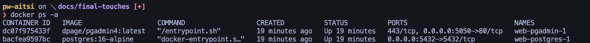
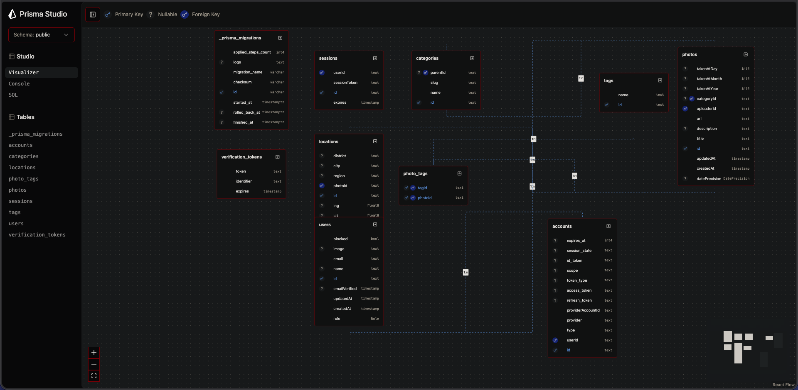

# Raport Końcowy: Local Archive

## Opis projektu - tematyka

Aplikacja "Local Archive" to platforma cyfrowego archiwum społecznościowego. Jej głównym celem jest umożliwienie lokalnym mieszkańcom i pasjonatom historii gromadzenia, udostępniania oraz przeszukiwania starych fotografii dokumentujących ewolucję przestrzenną i historyczną danych regionów. System rozwiązuje problem rozproszonych i często niedostępnych materiałów archiwalnych, zapewniając cyfrowe, responsywne i intuicyjne miejsce do ich strukturyzacji, uwzględniając wymiar zarówno geograficzny jak i czasowy.

## Przyjęte rozwiązania i stack technologiczny

Projekt został zrealizowany jako nowoczesna aplikacja full-stackowa przy użyciu środowiska JavaScript/TypeScript, stawiając nacisk na typowanie statyczne i wysoką wydajność:

- **Next.js (App Router)**: Główne środowisko pracy bazujące na React. Obsługuje renderowanie po stronie serwera (SSR), co optymalizuje ładowanie stron.
- **TailwindCSS**: Narzędzie do stylizacji, zapewniające spójny system projektowy i dynamiczne wsparcie dla motywów (jasny / ciemny / wysoki kontrast).
- **PostgreSQL i Prisma ORM**: Relacyjna baza danych mapowana poprzez Prisma, zapewniająca spójność typów od bazy aż po interfejs użytkownika.
- **NextAuth.js**: Obsługa bezpiecznego logowania za pośrednictwem protokołu OAuth (Google).
- **Docker**: Konteneryzacja warstwy danych (baza PostgreSQL oraz interfejs pgAdmin), co gwarantuje łatwą replikację środowiska.

## Model danych

Baza danych oparta jest na modelu relacyjnym z optymalizacjami dla nietypowych danych historycznych.

- **Hierarchia kategorii**: Kategorie wykorzystują relację rekurencyjną (tzw. *adjacency list* poprzez pole `parentId`), co pozwala na tworzenie nieskończenie głębokich struktur geograficznych (Województwo -> Powiat -> Gmina -> Dzielnica).
- **Zdegradowana precyzja czasu**: Aby uniknąć wprowadzania fałszywych znaczników czasu (np. `1936-01-01` dla zdjęcia pochodzącego po prostu z "1936 roku"), daty rozbito na oddzielne pola `Year`, `Month` oraz `Day` łącząc je z dedykowaną flagą precyzji.
- **Relacje wiele-do-wielu**: Tagi przypisywane do zdjęć pozwalają na swobodne grupowanie materiałów z różnych kategorii geograficznych.

## Architektura Informacji

Struktura nawigacyjna serwisu odzwierciedla mentalny model użytkownika przeszukującego archiwa:

- **Przeglądanie (Eksploracja)**: Dostępne na ekranie głównym i stronie `/browse`. Widoki zbudowane są jako drzewa kategorii pozwalające na drążenie danych od ogółu do szczegółu (z mechanizmem ścieżek okruszków).
- **Wyszukiwanie (Celowanie)**: Dedykowana strona z wielowymiarowymi filtrami umożliwiająca zapytania przecinające się (np. "zdjęcia tramwajów, z Krakowa, przed 1945 rokiem").
- **Przestrzenie zastrzeżone**: Rozbudowany podział na panele "Moje zdjęcia" (zarządzanie własnym dorobkiem dla Twórców) oraz centralny Panel Administratora (nadzór nad użytkownikami i taksonomią kategorii).

## Architektura systemu

Aplikacja silnie korzysta z unifikacji frontendu i backendu w frameworku Next.js:

- Zrezygnowano ze sztucznego podziału na zewnętrzny backend REST i aplikację SPA. Komponenty serwerowe (RSC) bezpośrednio pobierają dane z Prisma ORM, redukując narzut sieciowy i odchudzając paczkę JavaScript wysyłaną do przeglądarki klienta.
- Krytyczna ścieżka autoryzacji realizowana jest całkowicie na krawędzi sieci (**Edge Middleware**). Blokada dostępu lub weryfikacja ról następuje zanim serwer bazowy rozpocznie jakikolwiek proces renderowania, co zwiększa odporność aplikacji.
- Dodawanie czy edycja materiałów obsługiwana jest poprzez asynchroniczne Akcje Serwerowe (Server Actions) lub lokalne endpointy `/api/`, z nałożonymi restrykcjami dla zablokowanych użytkowników.

## Autoryzacja i Zarządzanie Użytkownikami

Proces uwierzytelniania w aplikacji został oparty o bibliotekę **NextAuth.js (v5)** z wykorzystaniem dostawcy Google OAuth. Użycie adaptera Prisma pozwala na automatyczne tworzenie kont użytkowników w bazie PostgreSQL podczas pierwszego logowania.

System wykorzystuje strategię **JWT** (JSON Web Tokens). Krytyczna ścieżka autoryzacji i nadawania uprawnień realizowana jest niemal całkowicie na krawędzi sieci (**Edge Middleware**). Zanim serwer rozpocznie proces renderowania, Middleware odczytuje token JWT, weryfikując rolę użytkownika (`VIEWER`, `CREATOR`, `ADMIN`) oraz flagę blokady konta.

Z poziomu dedykowanego Panelu Administratora, uprzywilejowani użytkownicy mogą asynchronicznie modyfikować role innych oraz nakładać natychmiastowe blokady dostępu na konta łamiące regulamin (co ze względu na architekturę Middleware, odcina ich od aplikacji przy najbliższym odświeżeniu).

## Dokumentacja API

Backend projektu "Local Archive" udostępnia architekturę REST API (`/api/*`), zrealizowaną w standardzie Next.js App Router. Główne udostępnione punkty końcowe (endpoints) umożliwiają pełną interakcję z systemem:

- **`GET /api/photos`**: Zwraca stronicowaną listę zdjęć wraz z pełną obsługą zaawansowanych parametrów filtrowania (region, miasto, fraza tekstowa, zakres lat).
- **`POST, PATCH, DELETE /api/photos`**: Zabezpieczone ścieżki do pełnego cyklu życia zdjęć w archiwum (dodawanie, modyfikacja metadanych i usuwanie).
- **`POST /api/upload`**: Punkt obsługujący asynchroniczne wgrywanie i walidację plików graficznych (`multipart/form-data`).
- **`GET, POST, DELETE /api/categories`**: Endpointy operujące na pełnym drzewie kategorii geograficznych.
- **`PATCH /api/users/[id]/role` oraz `/block`**: Zastrzeżone ścieżki administracyjne do zarządzania systemem ról i blokad na platformie.

Pełna dokumentacja API, zawierająca precyzyjne przykłady wywołań poprzez polecenia `curl`, została umieszczona w osobnej dokumentacji technicznej (`docs/api.md`).

## Dostępność

System udokumentowano pod kątem bezwzględnej zgodności ze standardami WCAG 2.1 na poziomie AA. Walidację ciągłą zapewnia biblioteka `@axe-core/cli`, a dopełnia audyt manualny z wtyczką WAVE.

- **Klawiatura i czytniki**: Wdrożono ukryte odnośniki dla omijania bloków (`skip-link`), semantyczne punkty orientacyjne w kodzie HTML i jasne etykiety ARIA.
- **Orientacja wizualna**: Wszystkie interaktywne elementy po użyciu klawiatury wskazują swoją aktywność grubymi pierścieniami fokusu (`focus-visible`). Obrazy czysto dekoracyjne oznaczane są jako `alt=""`.
- **Wizja**: Dostarczono trzy palety kolorystyczne (w tym tryb o bardzo wysokim kontraście), oparte na obliczeniach z użyciem systemu tokenów Tailwind by z łatwością spełniać rygory czytelności minimalnej tekstów.
