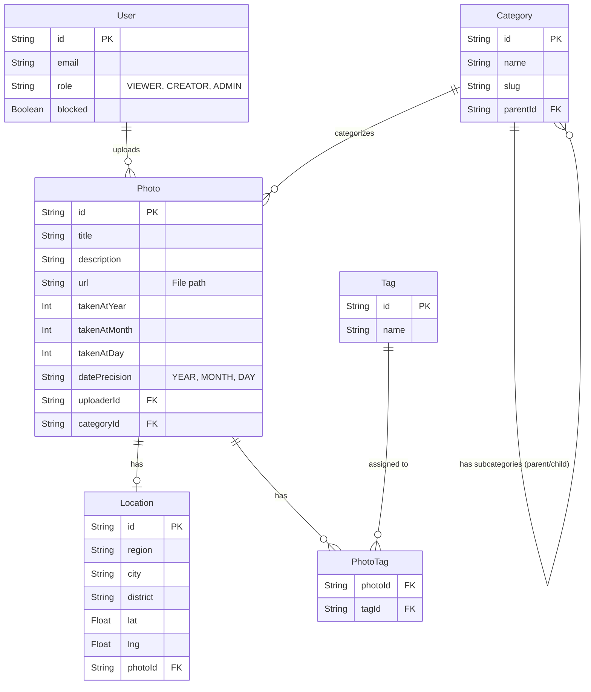

# Data Model

The database is built on PostgreSQL, utilizing Prisma ORM to map the relational database objects into strictly typed TypeScript interfaces.

## Entity Relationship Diagram (ERD)

## Schema Justification & Metadata Structure

### 1. Hierarchical Categories (Adjacency List)

The `Category` model contains a `parentId` field referencing another `Category`.

- **Justification:** This allows for an infinitely deep tree structure (Region -> City -> District) without needing multiple tables. This is perfect for geographical sorting. Prisma's include logic makes it easy to fetch children (e.g. all districts under "Warsaw").

### 2. Flexible Date Metadata (`datePrecision`)

Historical photos rarely have exact timestamps. A photo might only be known to be from "1936" or "June 1980".

- **Structure:** Instead of a strict `DateTime` object, the database splits dates into `takenAtYear`, `takenAtMonth`, and `takenAtDay` integer columns. An auto-derived `datePrecision` enum/string marks whether the date is accurate to the YEAR, MONTH, or DAY.
- **Justification:** Splitting the columns allows for strict mathematical querying (e.g., `WHERE takenAtYear BETWEEN 1930 AND 1945`) while elegantly handling partial dates without forcing dummy data (like saving January 1st when only the year is known).

### 3. Decoupled Location Table

The `Location` data is split into its own one-to-one associated table rather than cluttering the `Photo` model.

- **Justification:** Not all photos require detailed spatial data (latitude/longitude) or district granularity. Decoupling it keeps the `Photo` table lean and paves the way for potential future features like location-sharing or map clustering.

### 4. Many-to-Many Tags

Tags are mapped through an explicit `PhotoTag` joining table.

- **Justification:** A standardized tagging system allows users to find photos across different categories (e.g., searching for "train" across both Warsaw and Krakow regions). The explicit join table handles cascading deletes efficiently.
