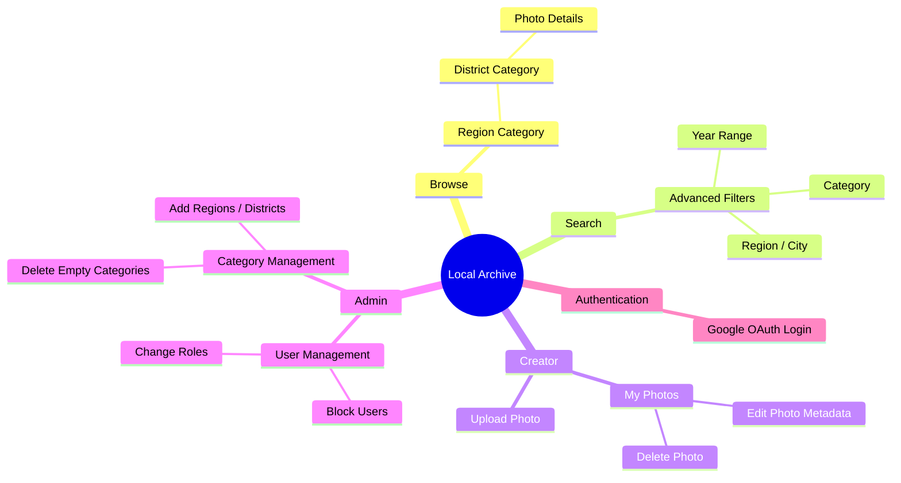

# Information Architecture

The information architecture of the Local Archive project is designed to facilitate easy discovery of historical photographs based on geographical location and metadata, while providing dedicated spaces for content creators and administrators.

## Goal and Justification

The structure solves the problem of organizing potentially thousands of historical photos into an intuitive, geographical hierarchy. Users looking for history about their area can navigate down from regions to specific districts, while power users can use advanced search filters to find highly specific content (e.g., photos from the 1930s in a specific city).

## Sitemap Diagram

## Section Breakdown

### 1. Browse (Exploration)

The Browse section is built hierarchically. Users start at the top level (Regions) and drill down into subcategories (Districts/Cities).

- **Justification:** Most users searching for historical photos search geographically. The hierarchical Category structure (`Region` -> `Subregion/District`) maps perfectly to user mental models.

### 2. Search (Targeted Discovery)

A dedicated search page with advanced filters.

- **Features:** Text search across titles, descriptions, and tags. Advanced filters allow intersection searches (e.g., "Category = Warsaw", "Year = 1930 - 1945").
- **Justification:** Geolocation isn't always enough. Historians often search by era or specific thematic tags.

### 3. Creator Dashboard (Content Management)

A restricted area for users with the `CREATOR` or `ADMIN` roles.

- **My Photos:** A dashboard to view, edit, and delete their own uploads.
- **Upload:** A form for submitting new archival materials.
- **Justification:** Separating viewing from creation keeps the main interface clean for the general public, while providing a dedicated workspace for active contributors.

### 4. Admin Dashboard (Moderation & Taxonomy)

Restricted strictly to the `ADMIN` role.

- **User Management:** Monitoring activity, assigning roles, and blocking malicious users.
- **Category Management:** Enforcing taxonomy rules by adding official categories and removing unused ones.
- **Justification:** A centralized moderation panel ensures data integrity and taxonomy consistency across the entire archive.
