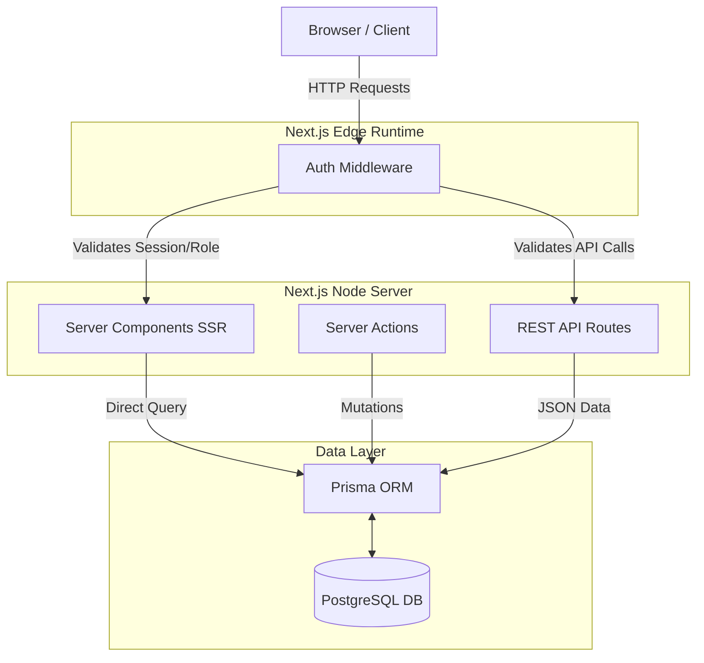

# System Architecture

The Local Archive is structured as a full-stack web application with the frontend and backend deeply integrated via the Next.js App Router framework.

## High-Level Architecture Diagram

## Architectural Decisions & Justifications

### 1. Unified Next.js Stack

Instead of separating the frontend (e.g., React SPA) and backend (e.g., Express API) into distinct repositories, the project leverages Next.js to combine them.

- **Justification:** Reduces deployment overhead, simplifies types sharing between client and server, and allows secure, direct database access via Server Components without exposing REST endpoints for every single data read operation.

### 2. Edge Middleware for Security

Authentication checks (via NextAuth JWT) and blocked user verifications happen at the Edge Middleware level (`middleware.ts`).

- **Justification:** Executing security rules at the edge prevents blocked or unauthorized users from ever reaching the expensive Node server execution or database layers, saving compute resources and improving security.

### 3. Server Components vs. Client Components

By default, all components are React Server Components (RSC). `use client` is only added to the leaves of the component tree (e.g., forms, buttons, interactive filters).

- **Justification:** This drastically reduces the JavaScript payload sent to the browser, leading to faster Time-to-Interactive (TTI) and better SEO, as most of the HTML is pre-rendered on the server.

### 4. Direct Database Queries vs. API Routes

For page renders (e.g., displaying the homepage, searching, browsing categories), Server Components query the Prisma ORM directly. REST API routes (`/api/photos`, `/api/categories`) are only implemented when necessary (e.g., for external access, asynchronous form submissions, or client-side fetch calls in complex UI states).

- **Justification:** Bypassing the network layer between the frontend server and backend API improves page load speeds.
